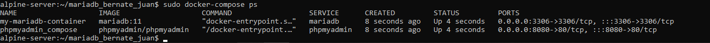
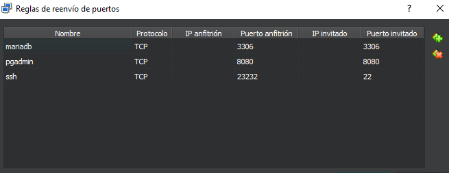
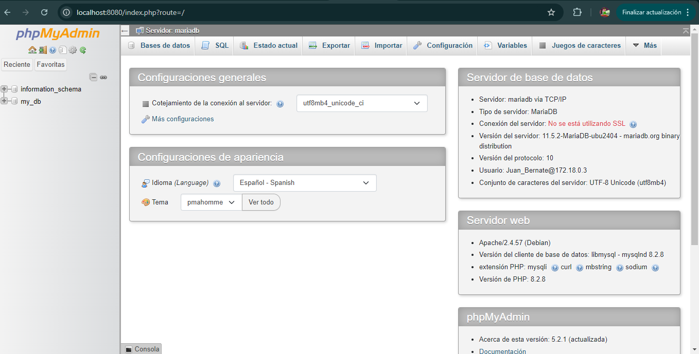

Autor: Juan David Bernate Salinas

Objetivo: Implementar cliente phpMyadmin conectado con Base de datos MariaDb utilizando docker compose

# Configuracion del docker-compose.yml

``` yml

services:
  mariadb:
    image: mariadb:11
    container_name: my-mariadb-container
    environment:
      MARIADB_USER: ${MARIADB_USER}
      MARIADB_PASSWORD: ${MARIADB_PASSWORD}
      MARIADB_ROOT_PASSWORD: ${MARIADB_ROOT_PASSWORD}
      MARIADB_DATABASE: ${MARIADB_DATABASE}
    ports:
      - "3306:3306"
    networks:
      - mariadb_network
    volumes:
      - mariadb_data:/var/lib/mysql
    env_file:
      - .env
  phpmyadmin:
    image: phpmyadmin/phpmyadmin
    container_name: phpmyadmin_compose
    ports:
      - "8080:80"
    environment:
      - PMA_HOST=mariadb
      - PMA_USER=${MARIADB_USER}
      - PMA_PASSWORD=${MARIADB_PASSWORD}
    networks:
      - mariadb_network
volumes:
  mariadb_data:

networks:
  mariadb_network:

```
Para establecer las variables de entorno, primero debes crear una copia del archivo .env.template y luego asignar valores a cada variable.

Las variables de entorno utilizadas para esta configuración son las siguientes:

MYSQL_ROOT_PASSWORD: Esta variable establece la contraseña del usuario root de la base de datos MySQL.

MYSQL_DATABASE: Indica el nombre de la base de datos que se generará al iniciar el contenedor.
MYSQL_USER: Define el nombre del usuario de la base de datos.

MYSQL_PASSWORD: Contraseña asociada al usuario de la base de datos.

PMA_USER: Especifica el nombre de usuario que se utilizará para acceder a PhpMyAdmin.
PMA_PASSWORD: La contraseña correspondiente para ingresar a PhpMyAdmin.

Se creó una red llamada mariadb_network para conectar los servicios de MariaDB y PhpMyAdmin. Además, se configuraron puertos y volúmenes para asegurar la persistencia de datos y permitir el acceso a la base de datos a través de la interfaz web de PhpMyAdmin en localhost:8080.

# Como implementar el proyecto de mariaDB

ejecute el siguiente comando para implementar los servicios.

```
docker-compose up -d
```
Verifique que los contenedores esten en ejecucion.

```
docker-compose ps
```


# Conexion con el cliente de mariaDB


La imagen presenta la configuración de las reglas de reenvío de puertos para PhpMyAdmin, que es esencial para facilitar su acceso:

Nombre: phpmyadmin - Este campo identifica de manera única la regla dentro de la configuración.

Protocolo: TCP - Indica que se está utilizando el protocolo TCP, que es el estándar para la transmisión de datos en redes.

Puerto anfitrión: `8080` - Este es el puerto en el sistema anfitrión que se utilizará para acceder a la interfaz de PhpMyAdmin a través de un navegador.

Puerto invitado: `8080` - Este es el puerto donde se ejecuta PhpMyAdmin en la máquina virtual o contenedor.

La regla establece una redirección del tráfico desde el puerto `8080` del host hacia el puerto `8080` en la máquina invitada, lo que simplifica el acceso a PhpMyAdmin y permite a los usuarios interactuar con la base de datos de forma más eficiente.

# Conexion con PhpMyAdmin con mariaDB


Para conectar PhpMyAdmin con MariaDB, asegúrese de tener configurada la red adecuada en Docker o en su entorno. Acceda a PhpMyAdmin desde el navegador usando `localhost:8080`



De acuerdo a esta informacion el cliente de PhpMyAdmin tiene que salir como muestra en la imagen anterior, el cual ya es el ultimo paso.
