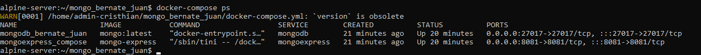
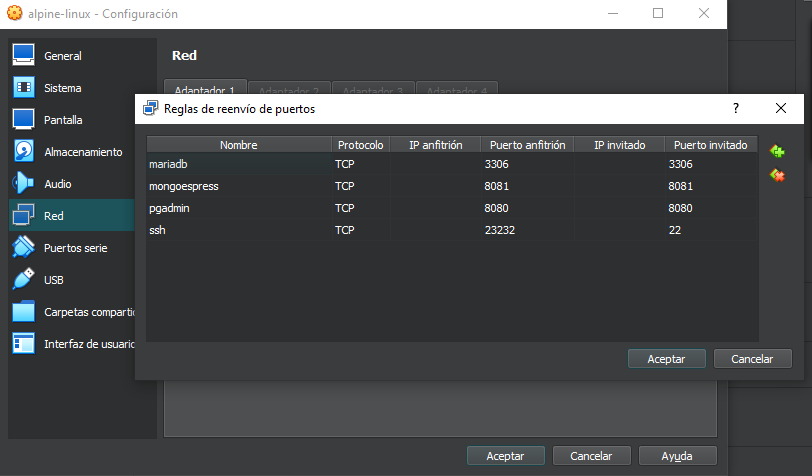
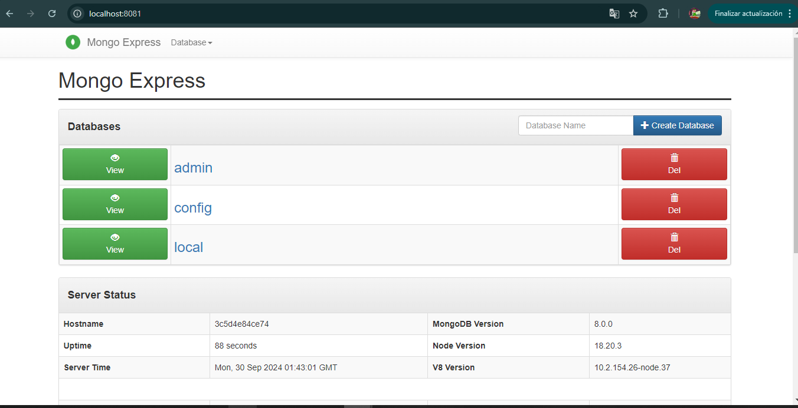

Autor: Juan David Bernate Salinas
Objetivo: Implementar cliente `MongoExpress` conectado con Base de datos Mongo utilizando docker compose

# Configuracion del docker-compose.yml

``` yml
version: '3.1'
services:
  mongodb:
    image: mongo:latest
    container_name: mongodb_bernate_juan
    environment:
      - MONGO_INITDB_ROOT_USERNAME=${MONGO_INITDB_ROOT_USERNAME}
      - MONGO_INITDB_ROOT_PASSWORD=${MONGO_INITDB_ROOT_PASSWORD}
    ports:
      - "27017:27017"
    volumes:
      - mongodb_data:/data/db
    networks:
      - mongo_network

  mongoexpress:
    image: mongo-express
    container_name: mongoexpress_compose
    ports:
      - "8081:8081"
    environment:
      - ME_CONFIG_MONGODB_ADMINUSERNAME=${MONGO_INITDB_ROOT_USERNAME}
      - ME_CONFIG_MONGODB_ADMINPASSWORD=${MONGO_INITDB_ROOT_PASSWORD}
      - ME_CONFIG_MONGODB_SERVER=mongodb
      - ME_CONFIG_BASICAUTH_USERNAME=${MONGO_INITDB_ROOT_USERNAME}   # Añadir para credenciales de acceso a Mongo Express
      - ME_CONFIG_BASICAUTH_PASSWORD=${MONGO_INITDB_ROOT_PASSWORD}   # Añadir para credenciales de acceso a Mongo Express
    networks:
      - mongo_network

volumes:
  mongodb_data:

networks:
  mongo_network:
```
Este archivo docker-compose.yml está configurado para levantar dos servicios: MongoDB y Mongo Express. Te explico cada parte:

1. version: '3.1'
Define la versión del esquema de Docker Compose que estás usando. La versión 3.1 es compatible con la mayoría de las características modernas de Docker.

2. services
Dentro de services, defines los contenedores que se levantarán cuando uses Docker Compose.

Servicio 1: mongodb
image: mongo
: Utiliza la imagen oficial de MongoDB en su versión más reciente (latest).

container_name: mongodb_bernate_juan: Define un nombre personalizado para el contenedor MongoDB. En este caso, será mongodb_bernate_juan.

environment: Aquí se configuran las variables de entorno para MongoDB.

MONGO_INITDB_ROOT_USERNAME: Esta variable crea el usuario administrador de MongoDB. Está referenciada desde un archivo .env con la sintaxis ${MONGO_INITDB_ROOT_USERNAME}.
MONGO_INITDB_ROOT_PASSWORD: Define la contraseña del usuario administrador de MongoDB, también leída del archivo .env.
ports:

"27017:27017": Mapea el puerto 27017 del contenedor al puerto 27017 de la máquina host. Este es el puerto predeterminado donde MongoDB escucha conexiones.
volumes:

mongodb_data:/data/db: Asocia un volumen persistente llamado mongodb_data con el directorio /data/db dentro del contenedor, donde MongoDB guarda su base de datos. Esto garantiza que los datos de la base de datos no se pierdan al reiniciar o eliminar el contenedor.
networks:

mongo_network: MongoDB está conectado a la red mongo_network, que le permite comunicarse con otros servicios, como Mongo Express.
Servicio 2: mongoexpress
image: mongo-express: Utiliza la imagen oficial de Mongo Express, una interfaz gráfica que facilita la administración de bases de datos MongoDB.

container_name: mongoexpress_compose: Define el nombre del contenedor Mongo Express como mongoexpress_compose.

ports:

"8081:8081": Mapea el puerto 8081 del contenedor al puerto 8081 del host. Este puerto es donde Mongo Express estará disponible para su acceso a través de un navegador.

environment: Configura variables de entorno específicas para Mongo Express.

ME_CONFIG_MONGODB_ADMINUSERNAME: Le pasa el nombre de usuario administrador de MongoDB desde el archivo .env.

ME_CONFIG_MONGODB_ADMINPASSWORD: Le pasa la contraseña del administrador de MongoDB desde el archivo .env.

ME_CONFIG_MONGODB_SERVER=mongodb: Aquí se especifica que Mongo Express debe conectarse al servicio llamado mongodb, es decir, al contenedor MongoDB definido anteriormente.

ME_CONFIG_BASICAUTH_USERNAME y ME_CONFIG_BASICAUTH_PASSWORD: Estas variables agregan autenticación básica para proteger el acceso a Mongo Express. Los valores también se leen desde el archivo .env, utilizando las mismas credenciales de MongoDB.

networks:

mongo_network: Mongo Express también está conectado a la red mongo_network, lo que le permite acceder a MongoDB de forma interna.

3. volumes
mongodb_data: Define un volumen llamado mongodb_data. Este volumen es persistente y se utiliza para almacenar los datos de la base de datos MongoDB. Esto asegura que los datos no se pierdan si el contenedor se elimina o reinicia.

4. networks
mongo_network: Crea una red personalizada llamada mongo_network. Esta red permite que los contenedores se comuniquen entre sí. MongoDB y Mongo Express están conectados a esta misma red, lo que les permite interactuar de manera privada dentro del entorno de Docker.

# Como implementar el proyecto de MongoExpress

ejecute el siguiente comando para implementar los servicios.

```
docker-compose up -d
```
Verifique que los contenedores esten en ejecucion.

```
docker-compose ps
```



# Conexion con el cliente de MongoExpress


En la imagen, se observa la configuración de red para el reenvío de puertos de diferentes servicios, incluyendo mongoexpress.

Para Mongo Express:

Nombre: mongoexpress
Protocolo: TCP (que es el protocolo utilizado para comunicaciones estables y fiables).

IP anfitrión: No está especificada, lo que significa que cualquier dirección IP en el sistema anfitrión puede acceder al servicio.

Puerto anfitrión: `8081`, este es el puerto en el sistema anfitrión (tu máquina local o servidor).

IP invitado: No especificada, por lo tanto, cualquier dirección IP dentro de la máquina virtual o contenedor puede acceder.

Puerto invitado: `8081`, el puerto dentro del contenedor que expone Mongo Express.

Esto significa que cuando accedes al puerto `8081` de tu máquina anfitriona (tu PC), estás redirigiendo la solicitud al puerto `8081` dentro del contenedor de Mongo Express, lo que te permite gestionar bases de datos MongoDB a través de su interfaz web.

# Conexion con PhpMyAdmin con MongoExpress

Para conectar `MongoExpress` con Mongo, asegúrese de tener configurada la red adecuada en Docker o en su entorno. Acceda a `MongoExpress` desde el navegador usando `localhost:8081`



De acuerdo a esta informacion el cliente de MongoExpress tiene que salir como muestra en la imagen anterior, el cual ya es el ultimo paso.
